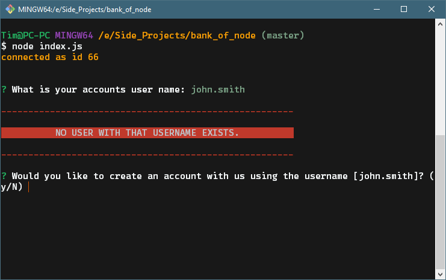
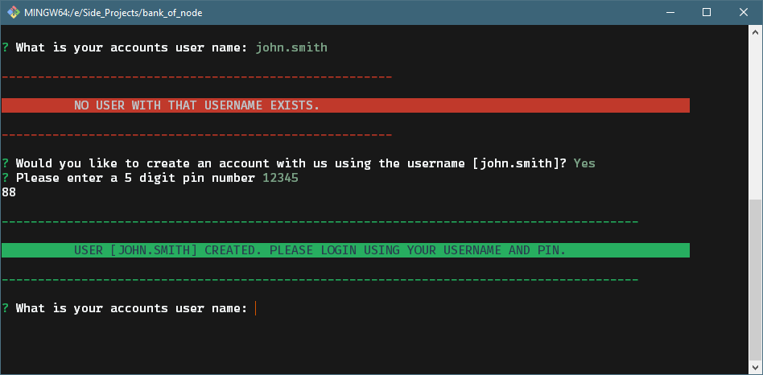
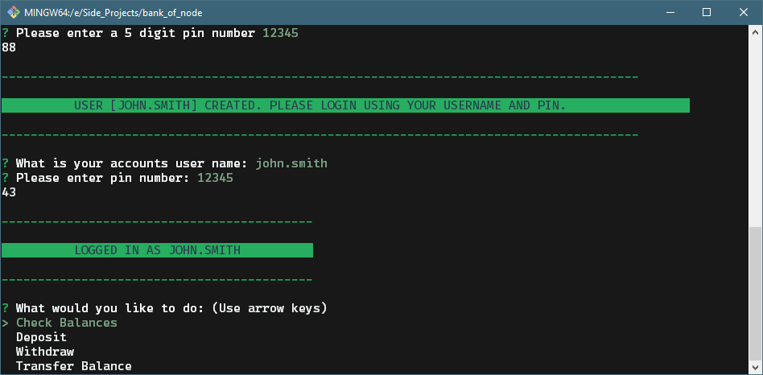
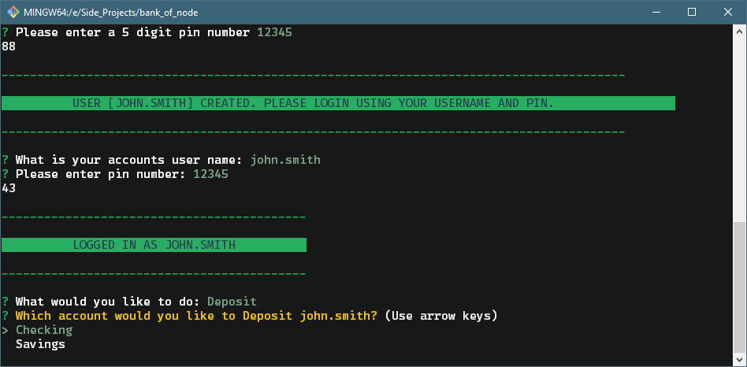
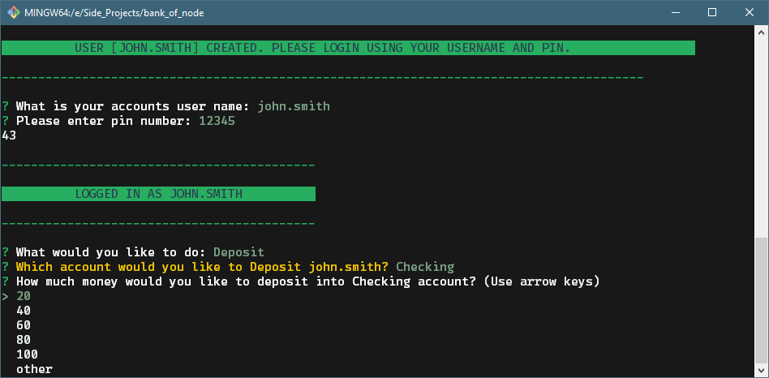
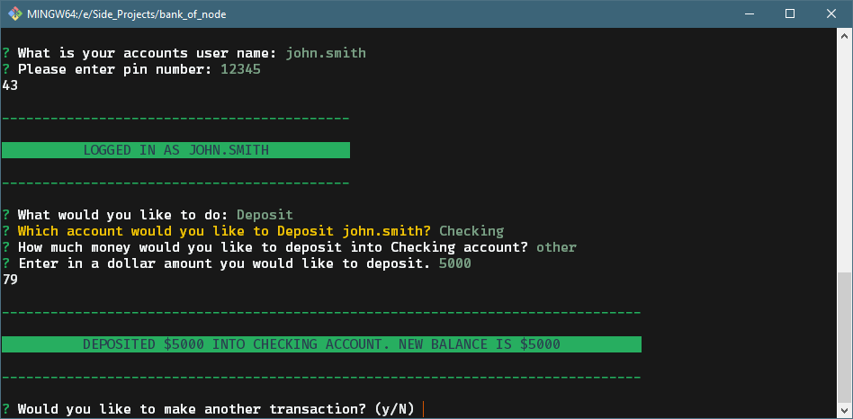
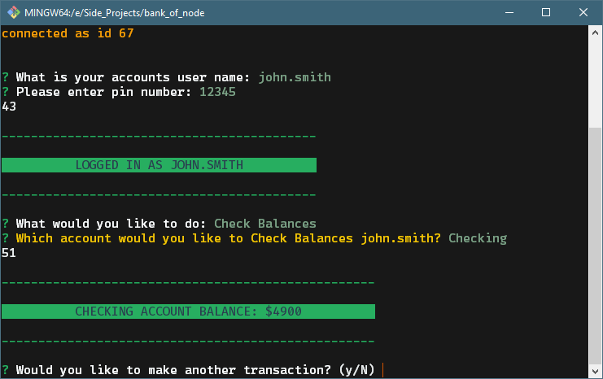
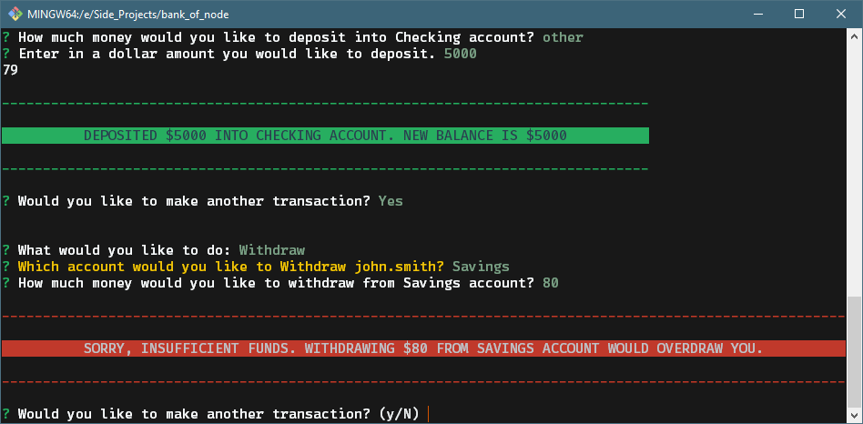
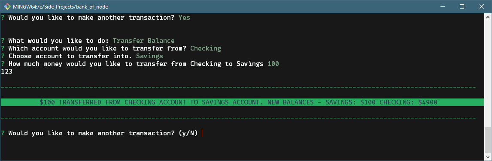
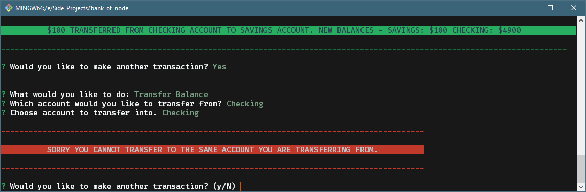

# Bank of Node
___
### Requirements to use this node application:
* Node installed
* NPM installed
* MySQL Database installed
* SQL software to access database such as MySQL Workbench for windows or SequelPro for mac
* Create .env file to hold database info

___

### Clone this repo to your computer and then run
```
npm install
```

# General Instructions
___
## Getting started

#### The first prompt you'll see is to enter your username.
#### If no such user exists you will be prompted to create an account or end the program.


#### Answering the prompts will add the user to the database with the pin as their login pin
#### You will then be asked to login again using the information



#### Once you are logged in you will see 4 types of actions you can do.
#### Since you are a new user to the bank you will have no money, so it's probably a good idea to deposit some.


#### You'll be asked which account to deposit into


#### You're then asked how much you would like to deposit


#### Once the action ends it will print that you deposited the selected amount into your chosen account.

##### -- I won't go into detail showing the deposit for savings account as it is the exact same prompts and actions --

___

#### Check balances shows the balance for whichever account you've selected to check.

___

#### Withdrawing is the same as deposited, but taking money out instead of depositing... 
#### If you try to take out more money than you have in your account then you will be met with an error log showing that you dont have enough money in that account. It will not allow you to overdraw from the accounts.


#### When using the transfer function you will be able to transfer from one account to another. You must pick different accounts to transfer to and from.


#### If the same account is selected for both transfer the transaction is stopped because you cannot transfer to and from the same account.

## I hope you've enjoyed this neat little banking app. I made it for fun to test my MySQL and node skills.